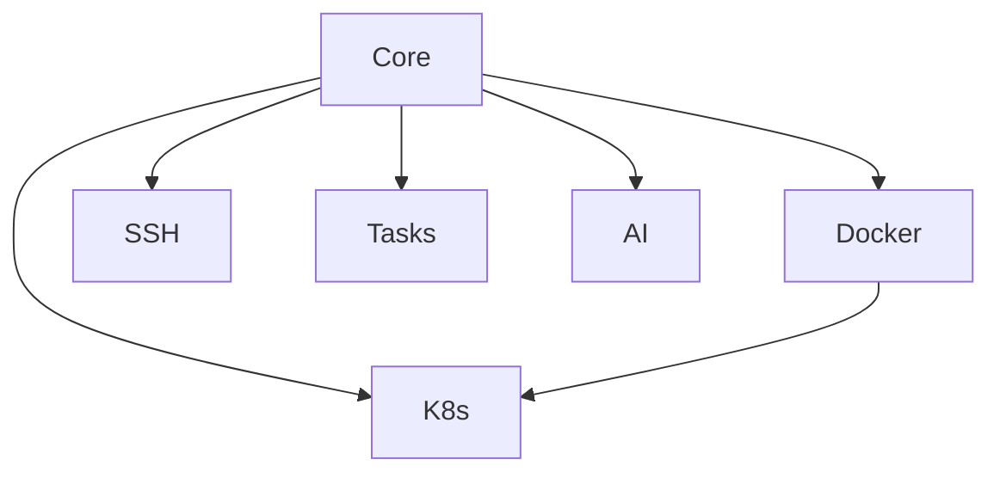

# SmartCLI Modules

This document provides an overview of all available modules in SmartCLI.

## Core Modules

These modules are essential for SmartCLI operation.

| Module | Version | Status | Description |
|--------|---------|--------|-------------|
| Core | 1.0.0 | Stable | Core functionality and utilities |
| Docker | 1.0.0 | Stable | Docker container and image management |

## Optional Modules

These modules provide additional functionality.

| Module | Version | Status | Description |
|--------|---------|--------|-------------|
| AI | 1.0.0 | In Development | AI-assisted development tools |
| K8s | 1.0.0 | In Development | Kubernetes cluster management |
| SSH | 1.0.0 | In Development | SSH connection management |
| Tasks | 1.0.0 | In Development | Task automation tools |

## Module Dependencies



## Installation Status

To check if a module is installed:

```powershell
smartcli module list
```

To install a module:

```powershell
smartcli module install <module-name>
```

## Module Development

For information on developing new modules, see:
- [Contributing Guidelines](../CONTRIBUTING.md)
- [Module Development Guide](./development.md)
- [Testing Guidelines](./testing.md)

## Module Documentation

Each module has its own detailed documentation:

- [Core Module](./Core.md)
- [Docker Module](./Docker.md)
- [AI Module](./AI.md)
- [Kubernetes Module](./K8s.md)
- [SSH Module](./SSH.md)
- [Tasks Module](./Tasks.md)

## Module Status Definitions

- **Stable**: Thoroughly tested and ready for production use
- **Beta**: Feature complete but may have minor issues
- **Alpha**: Under active development, may have breaking changes
- **In Development**: Not yet ready for general use
- **Deprecated**: Will be removed in future versions
- **Maintenance**: Only receiving bug fixes

## Version Compatibility

| Module | PowerShell Version | OS Compatibility |
|--------|-------------------|------------------|
| Core | 5.1+ | Windows, Linux, macOS |
| Docker | 5.1+ | Windows, Linux, macOS |
| K8s | 5.1+ | Windows, Linux, macOS |
| SSH | 5.1+ | Windows, Linux, macOS |
| Tasks | 5.1+ | Windows, Linux, macOS |
| AI | 5.1+ | Windows, Linux, macOS |

## Support Status

For support with any module:

1. Check the module's documentation
2. Search existing [issues](../../issues)
3. Create a new issue if needed

## Roadmap

See our [project roadmap](../../ROADMAP.md) for planned module developments and improvements.
